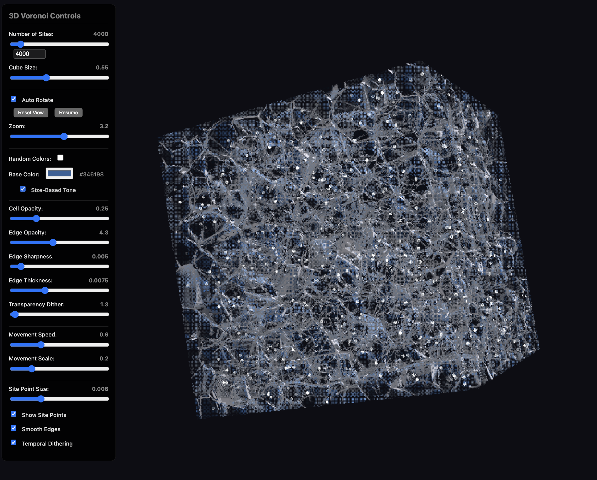
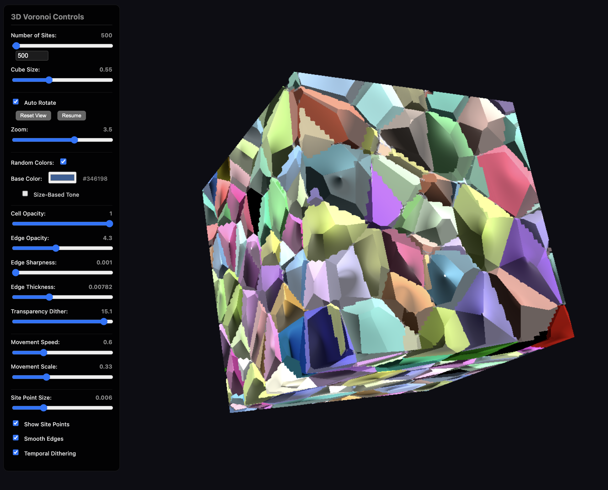

# Self‑Steering 3D Voronoi (Three.js)

A high-performance 3D Voronoi diagram visualization using voxel grid acceleration, implemented in Three.js with GLSL shaders.

## 🔗 Links

- **[Live Demo](https://virtualorganics.github.io/Self-Steering-3D-Voronoi-Three.js/)**
- **[Shadertoy reference (self‑steering)](https://www.shadertoy.com/view/WXGSWm)**

## 📸 Screenshots




## Features

- **Dynamic Site Count**: Adjustable from 10 to 4,000 Voronoi sites in real-time (default build)
- **Voxel Grid Acceleration**: Efficient spatial data structure for fast nearest neighbor queries
- **Jump Flooding Algorithm**: Progressive refinement for accurate Voronoi cell boundaries
- **Advanced Visual Effects**:
  - Dithered transparency for cell faces
  - True 1D Voronoi edges detection
  - Smooth edge transitions
  - Temporal anti-aliasing
  - Site point visualization
- **Interactive Controls**:
  - Real-time parameter adjustment
  - Mouse/touch rotation
  - Zoom control
  - Pause/resume animation
  - Color customization
- **Performance Optimized**:
  - Multi-buffer rendering pipeline
  - Ping-pong buffering to avoid feedback loops
  - Configurable update intervals

## Installation

```bash
# Clone the repository
git clone https://github.com/VirtualOrganics/Self-Steering-3D-Voronoi-Three.js.git

# Install dependencies
npm install

# Run development server
npm run dev

# Build for production (outputs to docs/ for GitHub Pages)
npm run build -- --config self_steering/vite.config.js

## Deploy to GitHub Pages (main branch)

1. Push your changes to `main` on GitHub.
2. In GitHub: Settings → Pages → Source: “Deploy from a branch”.
3. Select Branch: `main`, Folder: `/docs` → Save.
4. Your site will be available at `https://virtualorganics.github.io/Self-Steering-3D-Voronoi-Three.js/` within a minute.
```

## How the self‑steering works

We alternate two simple behaviours per site:

- Relax: briefly untangle overlapping neighbours using local repulsion. We look up the 4 closest neighbour IDs from the voxel grid (Buffer B) and push away with a small jump scaled by local breathing‑room.
- Steer: move each site along its cell’s main long axis. The axis comes from Buffer C (fast boundary sampling + covariance power‑iteration). We apply steering with friction and min/max speed clamps and add soft repulsion to avoid overlaps.

This produces stable directional flow driven by current cell shapes. All distances scale with cube size relative to a 0.55 baseline, so behaviour stays consistent when you change world scale.

### GPU passes

- Buffer A (Positions): Applies relax/steer to positions with periodic wrapping.
- Buffer B (Voxel Owners): 3D grid of nearest IDs; updated every N frames with a small jump‑flood refinement.
- Buffer C (Steering Signal): Samples each cell boundary via short rays to find the longest axis and its direction.
- Buffer D (State): Smooths the steering vector and manages the relax/steer timing (RELAX_DURATION / STEER_DURATION).
- Image/Main: Raymarches the Voronoi surface using the 4 nearest IDs from the voxel grid.

### Key UI knobs

- Sites, Cube Size, Steering Strength, Friction, Min/Max Speed
- Repulsion Radius/Strength, Relax jump factor
- Show Site Points, Edge Sharpness/Thickness/Opacity
- Periodic Boundaries toggle, Auto‑Rotate

## Technical Details

### Architecture

The visualization uses a multi-pass rendering approach:

1. **Buffer A**: Calculates and animates site positions in local space
2. **Buffer B**: Maintains voxel grid acceleration structure using Jump Flooding Algorithm
3. **Main Pass**: Raymarches through the voxel grid with visual effects

### Shader Pipeline

- **Common Shader**: Shared utilities and constants
- **Buffer A Fragment**: Site position calculation with noise-based animation
- **Buffer B Fragment**: Voxel grid update with JFA refinement  
- **Main Fragment**: Raymarching with Voronoi distance calculations

### Key Technologies

- **Three.js**: WebGL framework for 3D graphics
- **GLSL ES 3.0**: Shader programming
- **WebGL 2.0**: Advanced GPU features including float textures
- **Vite**: Build tool and development server

## Controls

### Interface Controls

- **Number of Sites**: 10 - 50,000 sites
- **Cube Size**: Scale of the bounding cube
- **Cell Opacity**: Transparency of Voronoi cells
- **Edge Opacity**: Intensity of cell edges
- **Edge Sharpness**: Crispness of edges
- **Edge Thickness**: Width of edge lines
- **Movement Speed/Scale**: Animation parameters
- **Site Points**: Toggle visibility of Voronoi sites
- **Color Options**: Random colors or single base color with size-based tones

### Keyboard & Mouse

- **H**: Toggle controls panel
- **Mouse Drag**: Rotate view
- **Mouse Wheel**: Zoom in/out
- **Touch**: Pinch to zoom, drag to rotate

## Browser Requirements

- WebGL 2.0 support
- Modern browser (Chrome, Firefox, Safari, Edge)
- GPU with float texture support

## Performance Notes

- **100-1000 sites**: Excellent performance on all systems
- **1000-5000 sites**: Good performance on modern GPUs
- **5000-10000 sites**: May impact performance on older hardware
- **10000+ sites**: Requires powerful GPU

## License

MIT License - See LICENSE file for details

## Credits

Based on advanced Voronoi algorithms and GPU optimization techniques. Ported from Shadertoy to Three.js with additional features and optimizations. 